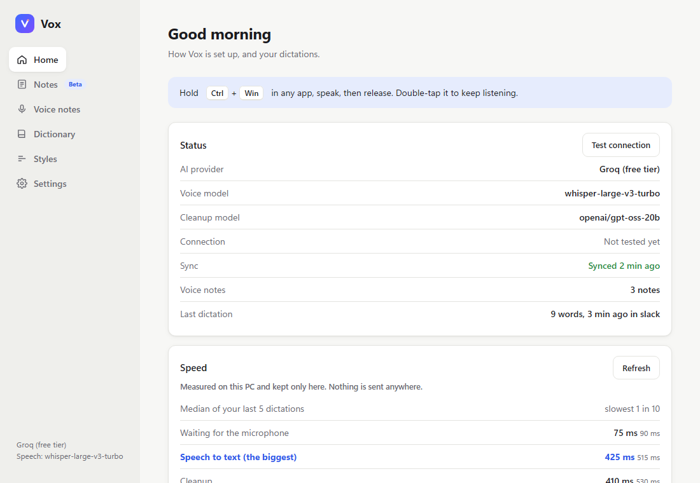
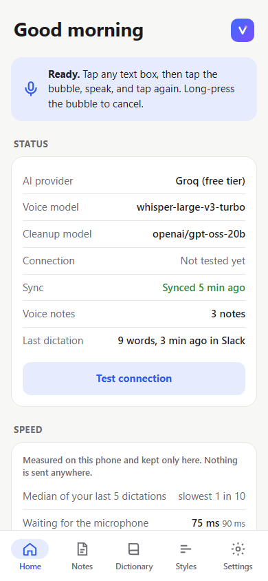

# Vox

[](https://github.com/minhajuddinm/vox/actions/workflows/build.yml)
[](../../releases/latest)
[](LICENSE)

Push-to-talk dictation for **Windows** (Python tray app) and **Android** (Java, accessibility bubble). Audio goes to a speech-to-text endpoint and the text to a cleanup LLM, both **BYO**: any OpenAI-compatible server (Groq free tier by default, OpenAI, OpenRouter, Together, Mistral, Ollama, LM Studio, Speaches) with your own key. No Vox server, no account, no telemetry.

Original author: Muhammad Minhajuddin ([minhajuddinm](https://github.com/minhajuddinm)). v2: [Yuvi-5](https://github.com/Yuvi-5) with Claude Code. Site: [minhajuddinm.github.io/vox](https://minhajuddinm.github.io/vox/). Changes: [CHANGELOG](CHANGELOG.md).

| Windows | Android |
|---|---|
|  |  |

Screenshots are rendered from the apps' own pages with sample data ([tools/render_screenshots.py](tools/render_screenshots.py)); [more](docs/screenshots/).

## Install

**Windows:** download `VoxSetup.exe` from [Releases](../../releases/latest) and run it (per-user, no admin). SmartScreen warns because the installer is unsigned: More info, Run anyway. Allow desktop-app microphone access in Windows Privacy settings. First start asks for a provider and key; a free Groq key (`gsk_...`) comes from [console.groq.com](https://console.groq.com).

**Android:** download `Vox.apk`, open it, allow installs from the source, and "Install anyway" on the Play Protect warning (sideloaded app with an accessibility service). Then in Vox: add key, allow microphone, enable the accessibility service (Settings, Accessibility, Vox dictation bubble). On Android 13+ the switch is greyed until App info, three dots, **Allow restricted settings**. Set battery use to Unrestricted. In-app steps: Settings, System, **Install help** ([details](documentation/specs/p9g2-install-safety.md)). A sideloaded APK cannot avoid these warnings. Update by installing over the old APK; if refused, the signing key differs, so uninstall first.

## Use

| | Windows | Android |
|---|---|---|
| Dictate | hold **Ctrl+Win**, speak, release | tap the bubble, speak, tap |
| Cancel | **Esc** | long-press bubble |
| Keep listening (up to 60 min) | double-tap Ctrl+Win; Note or Type target | - |
| Voice note | **Ctrl+Alt+N**, tray | note bubble, notification, Quick Settings tile |
| Paste last | **Shift+Alt+Z** | - |

Tap-or-hold and a hands-free chord are optional (Settings). Logs: `%APPDATA%\Vox\vox.log`. Update: run the new installer (data is kept). Uninstall: Windows Settings, Apps; delete `%APPDATA%\Vox` and `Documents\Vox Notes` to remove data.

Own server: Settings, preset or **Server address** (e.g. `http://100.x.y.z:8000/v1`). Plain `http://` is accepted only for localhost, LAN and Tailscale addresses; everything else needs `https://`.

## Features

| Area | Both apps | Windows only |
|---|---|---|
| Cleanup | Prompt copies words and fixes punctuation, case, spelling. A fidelity guard compares output with the transcript and falls back to your own words, only lightly tidied, on word loss. Light (keeps fillers) or Standard. **Use raw** in History | Paragraph breaks at pauses |
| Text | Spoken lists (first/second, bullet, pehla/doosra), snippets (inserted after cleanup, never sent), spoken commands, dictionary with fuzzy matching, About you, tone per app | Code mode ([table](documentation/15-code-mode.md)): camel/snake/pascal formatters and symbols, verbatim in code apps |
| Learning | Learn from my corrections (3 min or until sent; changed words only; on by default) | Improve my cleanup (LLM suggests rules; sends nothing until you confirm) |
| Input | Voice notes, history, Speed card (local timings) | Hotkeys, edit by voice (experimental), mic-ready ring buffer (off), terminal paste, Win+V history, FLAC upload, meeting notes (beta) |
| Sync | Optional self-hosted [relay](relay/README.md): notes, profile, devices list, can proxy the AI key. Python file or standalone Windows/Linux/arm64 binaries | Runs from the tray |
| Android | Bubble with watchdog and diagnostics, mic choice, Install help | |

## Status

v2.0.0 (2026-10-05) is built and tested by CI (Python tests, Java tests via `spec/golden.txt` parity, relay on 3.9/3.13 x86/arm64, installer/APK/relay builds). **Not yet run on real hardware:** Android v2 features, keep listening, learn from corrections, code mode, terminal paste, the pill-vanishing fix, the relay on a Pi/Tailscale, the built installer. Cleanup thresholds were tuned on written examples, not real model output. Meeting notes are beta, untested. Windows installer is unsigned; Android keys and history are unencrypted in app-private storage. Open checks: [`device-test` issues](../../issues?q=is%3Aopen+label%3Adevice-test). Full list: [known issues](documentation/12-known-issues-and-roadmap.md).

## Privacy

- Audio goes to your speech server. Transcript, About you, dictionary, people and the **app name** (never the window title) go to your cleanup server; dictionary and people also go to the speech server as a spelling hint.
- Relay: only if enabled (notes and profile; audio/text in transit when used as the AI proxy; keys only with a separate off-by-default switch).
- Learn from corrections: for 3 min after typing, reads the focused field (max 20k chars, in memory, never password fields); only changed words are kept.
- Edit by voice sends the selection and instruction to the cleanup server. Improve my cleanup sends saved dictations only after **Run once** and **Send**.
- Windows: plain files in `%APPDATA%\Vox`, keys under DPAPI. Android: app-private storage, unencrypted.
- Full text: [documentation/09-security-privacy.md](documentation/09-security-privacy.md), [privacy policy](https://minhajuddinm.github.io/vox/privacy.html).

## Build and test

Python 3.12+ (3.13 used), JDK 17 and `android.jar` (platform 34) for Java tests; no Gradle.

```
python -m venv .venv
.venv\Scripts\pip install -r windows\requirements.txt -r tests\requirements.txt
.venv\Scripts\python windows\vox_app.py                  # run from source
.venv\Scripts\python -m pytest -q                        # Python tests
.venv\Scripts\python documentation\tools\check_docs.py   # docs checker (CI)
bash android/run-tests.sh                                # Java tests (ANDROID_JAR set)
bash android/compile-check.sh                            # type-check all Android sources
```

Tests write settings to `%APPDATA%`; the test fixtures isolate the profile. `windows\build_app.bat` builds the installer, `android/build.sh` the APK (build-tools 36). CI builds both on `v*` tags and publishes the release ([details](documentation/10-build-test-release.md)). Never commit `config.json`, `.env`, `relay.json/db`, keystores, `*.pem` or keys (all in `.gitignore`).

## Layout

`windows/` Python app · `android/` Java app (`src/`, `assets/index.html`, `test/`) · `relay/` stdlib server · `spec/golden.txt` shared expected results (Python and Java) · `tests/` pytest · `ui-shared/` shared page code (`tools/sync_ui.py`) · `tools/` benchmarks, screenshot renderer · `documentation/` developer docs ([start](documentation/README.md)) · `docs/` website · `.github/` CI and templates. Coding agents: [AGENTS.md](AGENTS.md).

## Contributing and licence

Issues, device-test reports and PRs welcome: [CONTRIBUTING](CONTRIBUTING.md). Security: [SECURITY](SECURITY.md) (private report). [Code of Conduct](CODE_OF_CONDUCT.md). [MIT](LICENSE).
